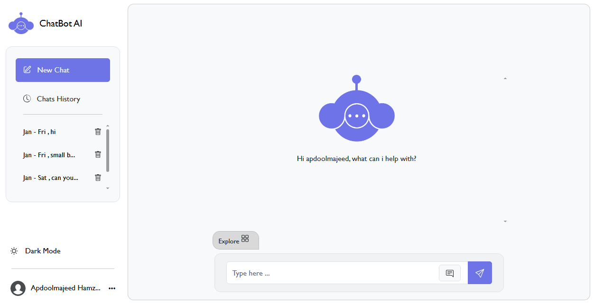

# ChatBot & Image Generator AI
# Guide:

*  Step 1. Clone the project

* Step 2. Copy the project folder and paste it inside root directory(for xampp xampp/htdocs, for wamp wamp/www, for lamp var/www/HTML)

* Step 3. Open PHPMyAdmin at (`http://localhost/phpmyadmin`)

* Step 4. Create a database with the name `chatbot_db`

* Step 5. Import `chatbot_db.sql` file (given inside the zip package in the SQL file folder)

# Note
Make sure to paste your Hugging Face API key inside "apikey.php" file!
